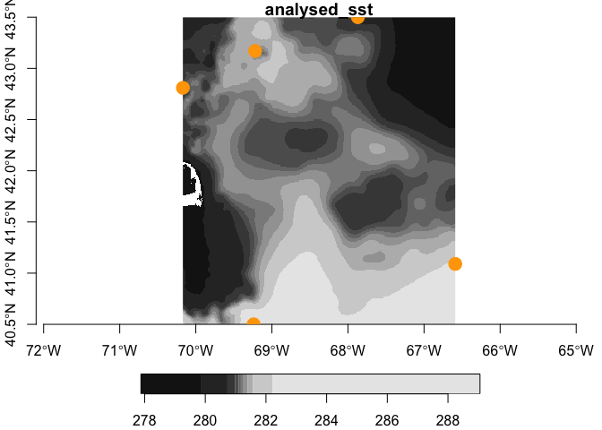

ghrsst
================

Access OPeNDAP GHRSST data from R. Extract point or bounded boxes (as
raster).

## Requirements

-   [R v4.1+](https://www.r-project.org/)

Packages from CRAN.

-   [rlang](https://CRAN.R-project.org/package=rlang)
-   [dplyr](https://CRAN.R-project.org/package=httr)
-   [sf](https://CRAN.R-project.org/package=sf)
-   [stars](https://CRAN.R-project.org/package=stars)
-   [tidyr](https://CRAN.R-project.org/package=tidyr)
-   [ncdf4](https://CRAN.R-project.org/package=ncdf4)

Packages from Github

-   [xyzt](https://github.com/BigelowLab/xyzt)

## Installation

    remotes::install_github("BigelowLab/ghrsst")

### Usage

``` r
suppressPackageStartupMessages({
  library(dplyr)
  library(sf)
  library(ghrsst)
  library(xyzt)
  library(stars)
})
```

#### Working with points.

See the [xyzt](https://github.com/BigelowLab/xyzt) package for more
details on the example Gulf of Maine data.

``` r
# read in example GOM points
x <- xyzt::read_gom() |>
  dplyr::select(-time, -depth) |>
  xyzt::as_POINT()

# generate a MUR url for a given date
url <- mur_url("2018-12-18")

# open the resource
X <- ncdf4::nc_open(url)

# extract the data 
covars <- ghrsst::extract(x, X, varname = mur_vars(X))

# bind to the input
(y <- dplyr::bind_cols(x, covars))
```

    ## Simple feature collection with 5 features and 7 fields
    ## Geometry type: POINT
    ## Dimension:     XY
    ## Bounding box:  xmin: -70.17 ymin: 40.5 xmax: -66.59 ymax: 43.5
    ## Geodetic CRS:  WGS 84
    ## # A tibble: 5 × 8
    ##   id    name         geometry analysed_sst analysis_error dt_1km_data
    ## * <chr> <chr>     <POINT [°]>        <dbl>          <dbl>       <int>
    ## 1 44098 Jeffr… (-70.17 42.81)         281.           0.37          NA
    ## 2 44005 Cashe… (-69.22 43.17)         281.           0.37         -55
    ## 3 44037 Jorda…  (-67.87 43.5)         281.           0.39          45
    ## 4 44011 Georg… (-66.59 41.09)         282.           0.39          NA
    ## 5 44008 Nantu…  (-69.24 40.5)         283.           0.38          18
    ## # … with 2 more variables: mask <int>, sea_ice_fraction <dbl>

#### Working with bounding boxes (from points or polygons).

Learn more about working with
[stars](https://CRAN.R-project.org/package=stars) objects in the
[vignettes](https://r-spatial.github.io/stars/).

``` r
# read in example GOM points
x <- xyzt::read_gom() |>
  dplyr::select(-time, -depth) |>
  xyzt::as_BBOX()

(covars <- ghrsst::extract(x, X, varnames = ghrsst::mur_vars(X)))
```

    ## stars object with 2 dimensions and 5 attributes
    ## attribute(s):
    ##                      Min. 1st Qu.  Median        Mean 3rd Qu.    Max.   NA's
    ## analysed_sst      277.878 280.896 281.174 281.1748818 281.471 289.056    459
    ## analysis_error      0.370   0.380   0.380   0.3836834   0.390   0.390    459
    ## mask                1.000   1.000   1.000   1.0055922   1.000   2.000      0
    ## sea_ice_fraction       NA      NA      NA         NaN      NA      NA 109080
    ## dt_1km_data       -55.000  18.000  41.000  22.4352115  45.000  45.000  72484
    ## dimension(s):
    ##   from  to offset       delta refsys point values x/y
    ## x    1 360 -70.17  0.00994444 WGS 84    NA   NULL [x]
    ## y    1 303   43.5 -0.00990099 WGS 84    NA   NULL [y]

Now let’s see what it looks like.

``` r
x <- xyzt::read_gom() |>
  dplyr::select(-time, -depth) |>
  xyzt::as_POINT()
par(mfrow = c(1,2))
plot(covars, attr = 'analysed_sst', axes = TRUE, reset = FALSE)
plot(sf::st_geometry(x), add = TRUE, col = "orange", pch = 19, cex = 2)
```

<!-- -->

``` r
# cleanup
ncdf4::nc_close(X)
```
