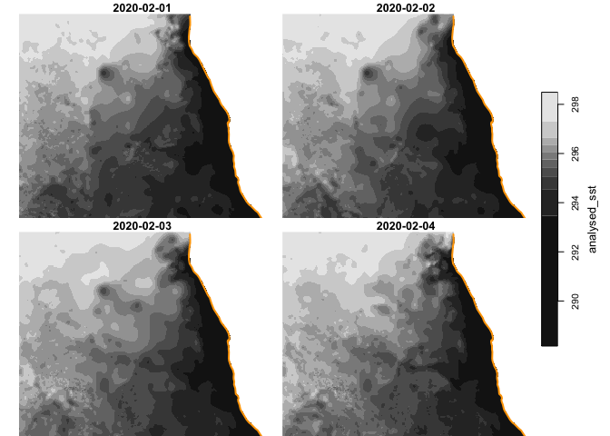
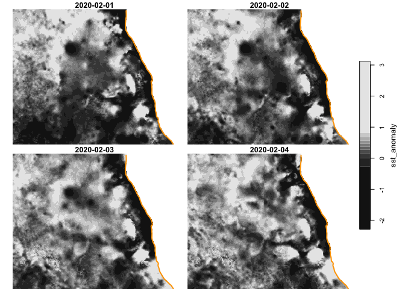

ghrsst
================

> This is version “v0.2”, which switches from use of OPeNDAP to PODAAC’s
> convenience apps. In addition to opening NetCDF connections, version
> “v0.1” (now defunct) demonstrated how you could extract point or small
> polygons form the NetCDF. Thsi new package is only about fetching and
> reading data from PODAAC, not about extratiing points or polygons from
> the data. To leaner more about extraction, see the
> [sf](https://r-spatial.github.io/sf/) and
> [stars](https://r-spatial.github.io/stars/) tutorials.

Access [GHRSST](https://www.ghrsst.org/) (aka
[MUR](https://www.earthdata.nasa.gov/about/competitive-programs/measures/multi-sensor-ultra-high-resolution-sst-field))
data and manage data from R. [PODAAC](https://podaac.jpl.nasa.gov/)
provides two nice command line tools (`podaac-data-downloader` and
`podaac-data-subscriber`). Our focus here is on
`podaac-data-downloader`.

Currently `podaac-data-downloader` only [downloads the global
file](https://github.com/podaac/data-subscriber/issues/134#issuecomment-1546155900),
but there are plans afoot to add a `--subset` argument so only portions
of the global raster are tranferred. Until then we download the entire
globe, but then provide tools for subsetting.

# Requirements

## Application from [PODAAC](https://podaac.jpl.nasa.gov/)

Install
[`data-subscriber`](https://podaac.github.io/tutorials/quarto_text/DataSubscriberDownloader.html)
from PODAAC. Be sure to set your credentials.

**Note** we have had good luck installing
[pipx](https://pypi.org/project/pipx/) rather than
[pip](https://pypi.org/project/pip/) as `pipx` will handle installation
into environments.

## Packages from CRAN

- [R v4.1+](https://www.r-project.org/)
- [rlang](https://CRAN.R-project.org/package=rlang)
- [dplyr](https://CRAN.R-project.org/package=httr)
- [sf](https://CRAN.R-project.org/package=sf)
- [stars](https://CRAN.R-project.org/package=stars)
- [tidync](https://CRAN.R-project.org/package=tidync)

## Installation

    remotes::install_github("BigelowLab/ghrsst, ref = "data-subscriber")

# Usage

``` r
suppressPackageStartupMessages({
  library(rnaturalearth)
  library(dplyr)
  library(sf)
  library(ghrsst)
  library(stars)
})
```

## Set up default paths

Data files are downloaded to a default data path; you can override this
as needed. It’s convenient to set it once and then forget it. Below is
an example, but you should adjust the path to suit your own needs.

    ghrsst::set_root_path("/Users/ben/Library/CloudStorage/Dropbox/data/ghrsst")

## Downloading

Downloading is mostly about selecting the start and end dates. Accepting
the defaults, files will be downloaded to `ghrsst::ghrsst_path("tmp")`
directory, which is not quite the same as a temporary directory. You’ll
want to clean out old files on a regular basis and we provide a tool to
help with that (see below).

``` r
ok = ghrsst::podaac_downloader(start_date = as.Date("2020-02-01"), end_date = "2020-02-04")
print(ok)
```

    ## [1] 0

## Listing the downloaded files

``` r
ff = ghrsst::podaac_list() |>
  print()
```

    ## [1] "/Users/ben/Library/CloudStorage/Dropbox/data/ghrsst/tmp/20200201090000-JPL-L4_GHRSST-SSTfnd-MUR-GLOB-v02.0-fv04.1.nc"
    ## [2] "/Users/ben/Library/CloudStorage/Dropbox/data/ghrsst/tmp/20200202090000-JPL-L4_GHRSST-SSTfnd-MUR-GLOB-v02.0-fv04.1.nc"
    ## [3] "/Users/ben/Library/CloudStorage/Dropbox/data/ghrsst/tmp/20200203090000-JPL-L4_GHRSST-SSTfnd-MUR-GLOB-v02.0-fv04.1.nc"
    ## [4] "/Users/ben/Library/CloudStorage/Dropbox/data/ghrsst/tmp/20200204090000-JPL-L4_GHRSST-SSTfnd-MUR-GLOB-v02.0-fv04.1.nc"
    ## [5] "/Users/ben/Library/CloudStorage/Dropbox/data/ghrsst/tmp/20200205090000-JPL-L4_GHRSST-SSTfnd-MUR-GLOB-v02.0-fv04.1.nc"

## Reading the downloaded data

At this point you don’t really need this package as you could read the
downloaded file(s) with your favorite NetCDF reader:
[ncdf4](https://CRAN.R-project.org/package=ncdf4),
[RNetCDF](https://CRAN.R-project.org/package=RNetCDF),
[stars](https://CRAN.R-project.org/package=stars),
[terra](https://CRAN.R-project.org/package=terra), or
[tidync](https://CRAN.R-project.org/package=tidync); any will do nicely.
We provide a wrapper around
[tidync](https://CRAN.R-project.org/package=tidync) to read into `stars`
objects.

``` r
namibia = get_namibia()
s = read_podaac(ff, bb = namibia, var = c("analysed_sst", "sst_anomaly"))
s
```

    ## stars object with 3 dimensions and 2 attributes
    ## attribute(s), summary of first 1e+05 cells:
    ##                  Min. 1st Qu.  Median        Mean 3rd Qu.    Max. NA's
    ## analysed_sst  289.851 293.653 294.663 294.2342406 295.038 296.241 2913
    ## sst_anomaly    -2.020  -0.515  -0.278  -0.2617328   0.009   0.974 2913
    ## dimension(s):
    ##      from   to     offset  delta refsys point x/y
    ## x       1 1701          0   0.01 WGS 84 FALSE [x]
    ## y       1 1301        -29   0.01 WGS 84 FALSE [y]
    ## time    1    5 2020-02-01 1 days   Date    NA

``` r
coast = rnaturalearth::ne_coastline(scale = "medium", returnclass = "sf") |>
  sf::st_geometry() |>
  sf::st_crop(namibia)
extra_plot = function(...){
  plot(coast, col = "orange", add = TRUE)
}
plot(s['analysed_sst'], hook = extra_plot)
```

<!-- -->

``` r
plot(s['sst_anomaly'], hook = extra_plot)
```

<!-- -->

## Cleaning up

Without intentional cleanup, the download directory may grow to an
unreasonable size. We provide a function to purge that directory as
needed.

    purge_podaac()
